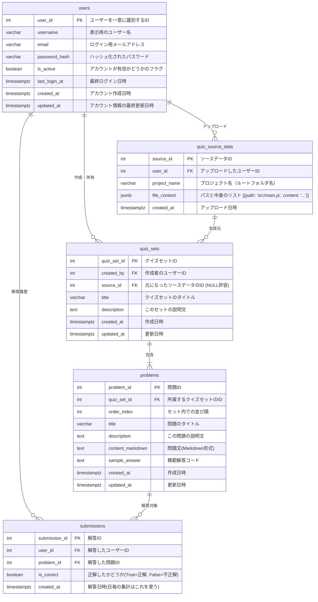

```mermaid
erDiagram
    users ||--o{ quiz_sets : "作成・所有"
    users ||--o{ submissions : "解答履歴"
    
    %% --- 新規追加: ユーザーはソースデータをアップロードする ---
    users ||--o{ quiz_source_data : "アップロード"

    %% --- 変更: クイズセットはソースデータから作られる（手動作成の場合はNULLなので0以上） ---
    quiz_source_data ||--o{ quiz_sets : "生成元"

    quiz_sets ||--|{ problems : "包含"
    problems ||--o{ submissions : "解答対象"

    users {
        int user_id PK "ユーザーを一意に識別するID"
        varchar username "表示用のユーザー名"
        varchar email "ログイン用メールアドレス"
        varchar password_hash "ハッシュ化されたパスワード"
        boolean is_active "アカウントが有効かどうかのフラグ"
        timestamptz last_login_at "最終ログイン日時"
        timestamptz created_at "アカウント作成日時"
        timestamptz updated_at "アカウント情報の最終更新日時"
    }

    %% --- 新規テーブル: ファイル群の中身と構造をJSONで一元管理 ---
    quiz_source_data {
        int source_id PK "ソースデータID"
        int user_id FK "アップロードしたユーザーID"
        varchar project_name "プロジェクト名（ルートフォルダ名）"
        jsonb file_content "パスと中身のリスト [{path: 'src/main.js', content: '...'}]"
        timestamptz created_at "アップロード日時"
    }

    quiz_sets {
        int quiz_set_id PK "クイズセットID"
        int created_by FK "作成者のユーザーID"
        int source_id FK "元になったソースデータのID (NULL許容)" 
        varchar title "クイズセットのタイトル"
        text description "このセットの説明文"
        timestamptz created_at "作成日時"
        timestamptz updated_at "更新日時"
    }

    problems {
        int problem_id PK "問題ID"
        int quiz_set_id FK "所属するクイズセットのID"
        int order_index "セット内での並び順"
        varchar title "問題のタイトル"
        text description "この問題の説明文"        
        text content_markdown "問題文(Markdown形式)"
        text sample_answer "模範解答コード"
        timestamptz created_at "作成日時"
        timestamptz updated_at "更新日時"
    }

    submissions {
        int submission_id PK "解答ID"
        int user_id FK "解答したユーザーID"
        int problem_id FK "解答した問題ID"
        boolean is_correct "正解したかどうか(True=正解, False=不正解)"
        timestamptz created_at "解答日時(日毎の集計はこれを使う)"
    }
```
