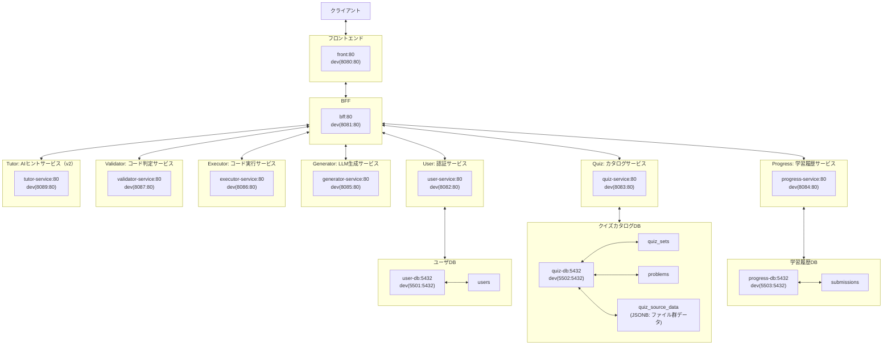

```mermaid
graph TD
    Client[クライアント]
    
    subgraph bff [BFF]
	    BFF-port["bff:80<br/>dev(8081:80)"]
    end
    
    subgraph front [フロントエンド]
	    Front-port["front:80<br/>dev(8080:80)"]
    end
    
    %% --- データ管理系サービス ---
    
    subgraph user-service [User: 認証サービス]
	    User-port["user-service:80<br/>dev(8082:80)"]
    end
    
    subgraph quiz-service [Quiz: カタログサービス]
	    Quiz-port["quiz-service:80<br/>dev(8083:80)"]
    end
    
    subgraph progress-service [Progress: 学習履歴サービス]
	    Progress-port["progress-service:80<br/>dev(8084:80)"]
    end
    
    %% --- 機能提供系サービス (DBなし / ステートレス) ---

    subgraph generator-service [Generator: LLM生成サービス]
	    Generator-port["generator-service:80<br/>dev(8085:80)"]
    end

    subgraph executor-service [Executor: コード実行サービス]
        Executor-port["executor-service:80<br/>dev(8086:80)"]
    end
    
    subgraph validator-service [Validator: コード判定サービス]
        Validator-port["validator-service:80<br/>dev(8087:80)"]
    end    
    
    subgraph tutor-service [Tutor: AIヒントサービス（v2）]
        Tutor-port["tutor-service:80<br/>dev(8089:80)"]
    end

    %% --- データベース群 ---

    subgraph user-db [ユーザDB]
	    user-db-port["user-db:5432<br/>dev(5501:5432)"]
        users
    end
    
    subgraph quiz-db [クイズカタログDB]
	    quiz-db-port["quiz-db:5432<br/>dev(5502:5432)"]
        quiz_sets
        problems
        quiz_source_data["quiz_source_data<br/>(JSONB: ファイル群データ)"]
    end
    
    subgraph progress-db [学習履歴DB]
	    progress-db-port["progress-db:5432<br/>dev(5503:5432)"]
        submissions
    end
    
             
    %% --- 接続 ---
    
    Client <--> front
    front <--> bff
    
    %% BFF to Services
    bff <--> user-service
    bff <--> quiz-service
    bff <--> progress-service
    bff <--> generator-service
    bff <--> executor-service
    bff <--> validator-service
    bff <--> tutor-service
    
    %% Services to DBs
    user-service <--> user-db
    user-db-port <--> users
    
    quiz-service <--> quiz-db
    quiz-db-port <--> quiz_sets
    quiz-db-port <--> problems
    quiz-db-port <--> quiz_source_data
    
    progress-service <--> progress-db
    progress-db-port <--> submissions
    
   
```
